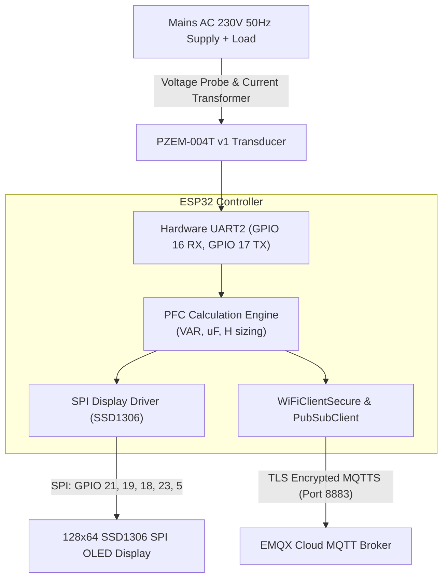

# ESP32 IoT Smart Power Meter & Power Factor Correction System

An embedded IoT electrical energy monitoring and automated power factor correction sizing system using ESP32, PZEM-004T AC sensor, SPI OLED display, and TLS-encrypted MQTTS cloud telemetry.


---

## Overview

The ESP32 IoT Smart Power Meter is an embedded electrical measurement and telemetry platform that monitors single-phase alternating current (AC) power parameters in real time. Built around the ESP32 microcontroller and a PZEM-004T v1 power monitoring transducer, the device measures RMS voltage, RMS current, active power, line frequency, and power factor. An onboard analytical engine continuously calculates reactive power deficit and specifies required capacitance (in microfarads) or inductance (in Henrys) to bring lagging or leading power factor up to target (0.95). Electrical diagnostics are rendered locally on a 128x64 SPI OLED display and transmitted periodically via TLS-encrypted MQTT (port 8883) to an EMQX cloud broker for remote monitoring.

---

## Features

- **Precision AC Electrical Sensing:** Measures True RMS Voltage (80-260V AC), RMS Current (0-100A via current transformer), Active Power (W), Line Frequency (Hz), and Power Factor (PF: 0.00 to 1.00).
- **Automated Power Factor Correction Engine:** Evaluates measured power factor against configurable target (`targetPF = 0.95`). If inductive lag is detected, automatically computes reactive compensation ($	ext{VAR}$) and required shunt capacitance ($C$ in $\mu	ext{F}$); for capacitive lead, computes required series inductance ($L$ in $	ext{H}$).
- **Hardware SPI Graphic Dashboard:** 128x64 monochrome SSD1306 OLED displays live power factor status, voltage, current, power, and compensation sizing values.
- **Enterprise-Grade Cloud Telemetry:** Transmits structured JSON telemetry over secure MQTTS (port 8883) with X.509 DigiCert Global Root G2 certificate verification to an EMQX cloud broker.
- **Network Time Synchronization:** Automatically synchronizes system timestamps via NTP (`pool.ntp.org`, IST UTC+5:30) for synchronized measurement logging.
- **Resilient Reconnection Loop:** Built-in automatic reconnection logic for Wi-Fi drops and MQTT broker disconnects.

---

## Hardware Architecture & Pin Mapping

### Components
- **Microcontroller:** ESP32 DevKit V1 (Xtensa 32-bit dual-core LX6)
- **Sensor:** PZEM-004T v1 AC Digital Multimeter Module with external split-core Current Transformer (CT)
- **Display:** SSD1306 0.96-inch 128x64 SPI OLED Display Module
- **Status Indicator:** Onboard / External Diagnostic LED on GPIO 2
- **Power Supply:** 5V DC regulated supply for ESP32 and display; PZEM optical isolation powered from AC input

### Pin Mapping Table

| Peripheral | Signal / Function | ESP32 GPIO | Electrical Specification |
|---|---|---|---|
| **PZEM-004T v1** | Serial RX (ESP32 RX2) | **GPIO 16** | Connects to PZEM TX (9600 baud, 8N1) |
| **PZEM-004T v1** | Serial TX (ESP32 TX2) | **GPIO 17** | Connects to PZEM RX (9600 baud, 8N1) |
| **SSD1306 OLED** | Master Out Slave In (MOSI) | **GPIO 21** | SPI Data line |
| **SSD1306 OLED** | Serial Clock (CLK / SCK) | **GPIO 19** | SPI Clock line |
| **SSD1306 OLED** | Data / Command Select (DC) | **GPIO 18** | High = Data, Low = Command |
| **SSD1306 OLED** | Chip Select (CS) | **GPIO 23** | Active Low SPI device select |
| **SSD1306 OLED** | Hardware Reset (RESET) | **GPIO 5** | Active Low hardware display reset |
| **Status LED** | Diagnostic Indicator | **GPIO 2** | High = Active / Transmission status |
| **Power Rails** | VCC / GND | 5V / 3.3V / GND | Shared common ground |

---

## Block Diagram



---

## Power Factor Correction Mathematics

When the measured power factor ($	ext{PF}_1$) is below target ($	ext{PF}_2 = 0.95$):
1. **Reactive Power Deficit:**
   $$Q_{	ext{comp}} = P \cdot \left(	an(rccos(	ext{PF}_1)) - 	an(rccos(	ext{PF}_2))
ight)$$
2. **Required Capacitance (for inductive lagging loads):**
   $$C = rac{Q_{	ext{comp}}}{2 \pi f V^2} 	imes 10^6 \ \mu	ext{F}$$
3. **Required Inductance (for capacitive leading loads):**
   $$L = rac{V^2}{2 \pi f Q_{	ext{comp}}} \ 	ext{H}$$

---

## Software & Tools

- **Language:** C++ (Arduino Framework)
- **Build System:** PlatformIO Core (`platform = espressif32`, `board = esp32dev`)
- **Key Libraries:**
  - `Adafruit SSD1306` (@ ^2.5.7) & `Adafruit GFX Library` (@ ^1.11.9) — SPI OLED driver
  - `knolleary/PubSubClient` (@ ^2.8) — MQTT client
  - `DALIHILLARY/PZEM-004T-V1` — PZEM UART sensor communication
  - `WiFiClientSecure` — TLS/SSL client with X.509 certificate validation

---

## Project Structure

```
power-meter/
├── README.md                   # System documentation and hardware specs
└──     ├── .vscode/
    │   └── extensions.json     # Recommended VS Code extensions
    ├── include/
    │   └── README              # Header directory guidance
    ├── lib/
    │   └── README              # Project-specific private libraries
    ├── src/
    │   └── main.cpp            # Firmware, measurement loops, and MQTT client
    ├── test/
    │   └── README              # Unit tests directory
    ├── platformio.ini          # PlatformIO dependencies and build configuration
    └── .gitignore              # Build artifact exclusions
```

---

## Setup and Usage

### Prerequisites
- Install [PlatformIO CLI](https://platformio.org/install/cli) or PlatformIO extension for Visual Studio Code.
- Connect your ESP32 board to the computer via USB.

### Build and Flash
```bash
# Clone the repository
git clone https://github.com/saptarshidas578/power-meter.git
cd power-meter

# Build firmware
pio run -e esp32dev

# Upload firmware to ESP32
pio run -e esp32dev -t upload

# Open Serial Monitor (115200 baud)
pio run -e esp32dev -t monitor -b 115200
```

### Configuration Notes
*Set your local Wi-Fi SSID, password, and MQTT credentials in `src/main.cpp`:*
```cpp
const char *ssid = "YOUR_WIFI_SSID";
const char *password = "YOUR_WIFI_PASSWORD";
const char *mqtt_broker = "YOUR_BROKER_HOST";
```

---

## Future Work

- [ ] Automated relay/triac capacitor-bank switching based on real-time calculated capacitor steps.
- [ ] Local web server dashboard (ESP32 WebSockets) for real-time waveform visualization.
- [ ] Export measurements to InfluxDB + Grafana dashboard for long-term power quality logging.

---

## Author & Contact

- **Author:** [saptarshi2007 (saptarshidas578)](https://github.com/saptarshidas578)
- **Institution:** B.Tech Electrical & Computer Science Engineering, VIT Vellore
- **LinkedIn:** TODO(author): add link

---

## License

Recommended: [MIT License](https://opensource.org/licenses/MIT).  
*TODO(author): confirm license selection.*
